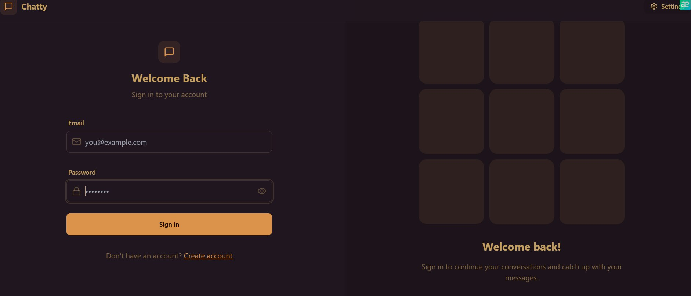

# Real-Time Chat Application (MERN Stack)

  


A full-stack real-time chat application built with the MERN stack (MongoDB, Express, React, Node.js) featuring instant messaging capabilities.

## Features

- **Real-time messaging** using Socket.IO
- User authentication with JWT
- Message history persistence
- Responsive UI with Tailwind CSS and DaisyUI
- File uploads with Cloudinary integration
- Toast notifications with React Hot Toast
- State management with Zustand

## Technologies Used

### Backend (Server)
- **Node.js** (ES Modules)
- **Express.js** - Web framework
- **Socket.IO** - Real-time communication
- **MongoDB** - Database (via Mongoose)
- **JSON Web Tokens** - Authentication
- **Cloudinary** - File storage
- **BcryptJS** - Password hashing

### Frontend (Client)
- **React** - UI framework
- **Vite** - Build tool
- **Socket.IO Client** - WebSocket integration
- **Zustand** - State management
- **Tailwind CSS** + **DaisyUI** - Styling
- **Axios** - HTTP client
- **Lucide React** - Icons

## Installation

### Prerequisites
- Node.js (v18+)
- MongoDB Atlas URI or local instance
- Cloudinary account (for file uploads)

1. **Clone the repository**
   ```bash
   git clone https://github.com/your-username/realtime-chat-app.git
   cd realtime-chat-app

2. **Install dependencies**
    npm run build

## Backend Setup
1. **Create .env file in /server directory:**
PORT=5000
MONGO_URI=mongodb+srv://<user>:<password>@cluster0.example.mongodb.net/chat-app
JWT_SECRET=your_jwt_secret_key
CLOUDINARY_CLOUD_NAME=your_cloud_name
CLOUDINARY_API_KEY=your_api_key
CLOUDINARY_API_SECRET=your_api_secret

2. **Run the server**
npm start
# For development mode:
npm run dev

## Frontend Setup
1. **Start the client**
cd client
npm run dev

## Project Structure
realtime-chat-app/
├── client/               # Frontend
│   ├── public/          # Static assets
│   └── src/             # React components
│       ├── features/    # Zustand stores
│       ├── components/  # UI components
│       └── App.jsx      # Root component
│
├── server/              # Backend
│   ├── src/
│   │   ├── config/      # Database config
│   │   ├── controllers/ # Business logic
│   │   ├── models/      # MongoDB schemas
│   │   ├── routes/      # API endpoints
│   │   └── utils/      # Helper functions
│   └── index.js         # Server entry
│
└── package.json         # Monorepo configuration

## Scripts
**Command	Description**
- npm run build	Install all dependencies (both)
- npm start	Start production server
- npm run dev	Start server in development mode
- client:dev	Start Vite dev server (from client)
- client:build	Build production client (from client)
- Environment Variables
- Server (.env)
- Variable	Description
- PORT	Server port (default: 5000)
- MONGO_URI	MongoDB connection string
- JWT_SECRET	JWT encryption key
- CLOUDINARY_CLOUD_NAME	Cloudinary credentials
- CLOUDINARY_API_KEY	Cloudinary API key
- CLOUDINARY_API_SECRET	Cloudinary API secret

## Deployment
1. **Build the client**
cd client
npm run build

2. **Deploy server**
Configure production environment variables

Use process manager like PM2:

pm2 start server/src/index.js

**Recommended hosting platforms:**

Backend: Render, Heroku, or DigitalOcean

Frontend: Vercel or Netlify

Database: MongoDB Atlas

File Storage: Cloudinary

**License**
This project is licensed under the ISC License.

- Developer: [Baisalov24]
- GitHub: https://github.com/Baisalov24
